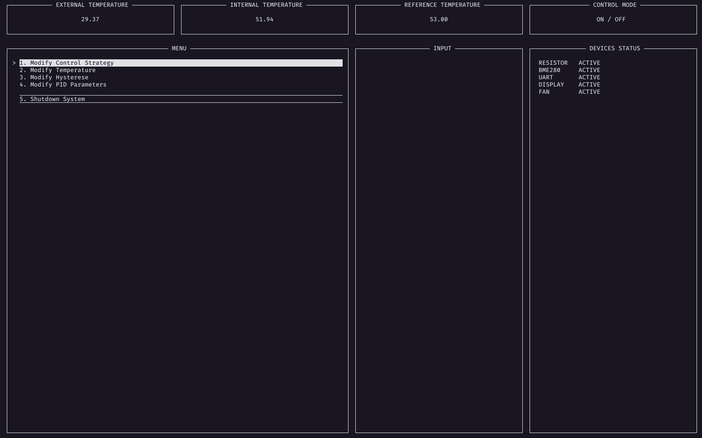

# Sistema de Controle de Temperatura

## Objetivos

Este sistema consiste em um gerenciador de temperaturas de um ambiente controlado desenvolvido como requisito de aprovação da matéria de Fundamentos de Sistemas Embarcados (2021/1) sob orientação do professor Renato Coral. Este sistema consiste em dois dispositivos que atuam no controle da temperatura, sendo um resistor, que gera calor, e uma ventoinha, que auxilia no resfriamento,. Nesse sistema existe um sensor de temperatura que interno que mede a temperatura do ambiente controlado.

Para conseguir atingir esse escopo, outros sensores são atuantes no esquema como evidencia o esquema abaixo.


Outros _épicos_ do sistema são a exibição dos dados do sistema com atualização em _real-time_ pelo terminal e interação para mudança dos parametros manualmente a qualquer instante. Os dados também são exibidos em um display LCD 16x2.

## Como executar

Dê o clone no repositório

```bash
    git clone https://github.com/rogerioo/Embarcados_Projeto01.git
```

Entre na pasta raiz do projeto

```bash
    cd Embarcados_Projeto01
```

Compile os executáveis do projeto

```bash
    make
```

Execute o projeto

```bash
    make run
```

## Interface



## Entradas e Saídas

As entradas do sistema consiste tantos nas informações fornecidas pelos sensores como pelas definidas pelo usuário via terminal, de forma que:

- Temperatura interna: proveniente do sensor `DS18B20` lido pelo barramento `UART` pela `ESP32` ou fornecida pelo terminal pelo usuário;

- Temperatura externa: proveniente do sensor `BME280` lido pelo barramento `I2C`;

- Temperatura de referência: proveniente do `potenciomêtro` lido pelo barramento `UART` pela `ESP32` ou fornecida pelo terminal pelo usuário;

- Modo de controle: proveniente do `switch` lido pelo barramento `UART` pela `ESP32`.

- Parâmetros do PID (**KP, KI, KD**): usa o padrã 5 1 5 ou fornecida pelo terminal pelo usuário;

As saídas são dadas pelo retorno das informações do status do sistema, de forma que pode ser lida:

- Pelo terminal, interfaceado pela biblioteca `ncurses` do C com atualizações em `real-time`;

- Pelo arquivo de log, gerado para cada vez que o sistema é iniciado com a respectiva hora na pasta `logs`;

- Pelo display `lcd` 16x2.

## Módulos do Sistema

- `bme280` módulo que fornece os drivers e funções para a recuperação de dados de temperatura;
- `control` módulo resposável pela recuperação de informaçãoes, geração do sinal de controle e controle do sistema;
- `crc` módulo responsável pela geração dos bytes de paridade usados para verificação da consistência dos dados transmitidos;
- `csv` módulo responsável pela geração do arquivo de log CSV;
- `display` módulo responsável pela comunicação com o display lcd 16x2;
- `pid` módulo responsável por gerar o sinal de controle pela estrágia do PID (Controlador Proporcional Integral Derivativo);
- `pwm` módulo responsável pela comunicação com os dispositivos de controle (Ventoinha e Resistor) pela `GPIO` usando o método do `PWM` (Pulse Width Modulation);
- `screen` módulo responsável pelo controle do terminal interativo;
- `uart` módulo responsável pela comunicação com o barramento UART da ESP32.

## Experimentos

Os gráficos abaixo evidenciam como o sistema opera dada cada estratégia de controle.

### Controle ON/OFF

Usando como valor de histerese `3`.

[](https://plotly.com/~rogerioo/1/?share_key=ECsqhC6rzEX1svFVJxpNtM)

[](https://plotly.com/~rogerioo/4/?share_key=bfrBi1O8mPxQVGWNetDMgf)

### Controle PID

Usando como valor do KP, Ki e KD `5` `1` `5`, respectivamente.

[](https://plotly.com/~rogerioo/3/?share_key=0VRExeCtK2uc0xk8vv48xn)

[](https://plotly.com/~rogerioo/5/?share_key=4b085hqgHN9bX8BI0YqfK5)

## Referências

- [Controle Liga/Desliga - Wikipedia](https://pt.wikipedia.org/wiki/Controle_liga-desliga)
- [Controle PID - Wikipedia](https://pt.wikipedia.org/wiki/Controlador_proporcional_integral_derivativo)
- [Driver sensor BME280](https://github.com/bitbank2/bme280)
- [Controle do LCD 16x2 em C](http://www.bristolwatch.com/rpi/i2clcd.htm)
- [PWM via WiringPi](https://www.electronicwings.com/raspberry-pi/raspberry-pi-pwm-generation-using-python-and-c)
